<!-- Página 1 -->

## Avance
Métodos Computacionales en Obras Civiles
Segundo Semestre 2026
Integrantes:
José Lobos Luis Noriega Matías Stierling
Profesor: Jose Antonio Abell Mena
7 de octubre de 2026

  *(536x142 px)*

<!-- Página 2 -->

1.​ El resultado es un laboratorio estructural digital del Edificio de Ingeniería: un modelo tridimensional
lineal elástico con seis grados de libertad por nodo, cargado a partir de áreas tributarias calculadas
geométricamente, analizado con OpenSeesPy, visualizado en un visor de escritorio escrito en Unity y,
finalmente, proyectado en realidad aumentada sobre la fachada real del edificio con un teléfono
Android.
Hay una decisión de diseño que atraviesa todo el trabajo y conviene enunciarla de entrada: el cálculo
se hace una sola vez, en el escritorio, y todo lo demás es visualización. Los resultados estructurales
viven en archivos JSON y CSV que funcionan como contrato entre programas; el visor de Unity los
dibuja, el explorador de combinaciones los recombina y el teléfono únicamente los muestra en su
lugar correcto del espacio real. Nada de lo que se ve en pantalla se recalcula por el camino. Esa
separación es lo que nos permitió validar cada etapa de forma independiente y es también la razón por
la que el mismo conjunto de datos alimenta igualmente al visor de escritorio y a la aplicación móvil.
Sobre los números que sustentan el trabajo: el modelo global tiene 1170 nodos de elementos finitos y
677 segmentos, de los cuales 673 quedan analizados y ninguno queda sin camino hacia un apoyo. La
idealización declara 442 vigas, 143 columnas, 84 muros, 10 losas y 33 apoyos. La transferencia de
cargas se verificó con el invariante de que la carga transferida es igual a la carga superficial por el área
tributaria, y los residuos quedaron en el orden de
comparando la suma de reacciones contra la suma de cargas aplicadas, cerró con un residuo de
kN
corridas de OpenSees hechas expresamente con la combinación armada, y la diferencia máxima
observada en la auditoría final fue de
También está completa la capacidad no lineal de sección, separada deliberadamente del modelo global
porque son dos preguntas distintas: cómo responde el edificio en su conjunto bajo cargas de servicio,
y cuánto aguanta cada elemento antes de fallar. Calculamos la curva momento-curvatura de una
columna representativa de 0,70 por 0,70 metros, sus envolventes de interacción axial-momento, la
envolvente equivalente de un muro, y propagamos esa capacidad a los 173 elementos verticales del
edificio para obtener relaciones demanda-capacidad. El visor de escritorio permite recorrer todo eso
de manera interactiva: cambia los factores de combinación con controles deslizantes, deforma el
modelo con amplificación configurable, dibuja diagramas de esfuerzos y muestra la relación
demanda-capacidad elemento por elemento. La experiencia de realidad aumentada ya fue probada en
un dispositivo físico, con seguimiento de imagen sobre una lámina impresa, anclas estables, escalas
calibradas y superposiciones de resultados.
El informe que sigue documenta cómo se construyó cada pieza, qué se verificó numéricamente en
cada etapa, qué decisiones tomamos y por qué, y qué límites tiene el resultado. Es un texto largo a

<!-- Página 3 -->

propósito: el proyecto es final y cada afirmación que hacemos está acompañada de su dato, su archivo
o su prueba.
2. Edificio e idealización
2.1 El edificio y cómo lo modelamos
El Edificio de Ingeniería se modeló como dos bloques separados, que en el proyecto aparecen como
Edificio 1 y Edificio 2, divididos por una junta de dilatación de 10 centímetros en el plano de ejes
101. Esta no es una decisión estética: la junta corta la continuidad estructural entre bloques, y por eso
cada uno se analiza por su cuenta. El bloque A es una torre de vigas y columnas con pilares de 70 por
70 centímetros; el bloque B es una caja de muros de corte. La planta útil del bloque A mide 21,90
metros en X y 27,32 metros en Y.
Los niveles de losa los tomamos de los propios planos: en los archivos DXF del proyecto aparecen
rótulos con la leyenda "NIVEL SUPERIOR LOSA" y de ahí salen las alturas que usamos, que son 1°S
a menos 4,01 metros, 1° a menos 0,05 metros, 2° a más 3,91 metros, 3° a más 7,87 metros y 4° o
techumbre a más 11,83 metros, con un entrepiso típico de 3,96 metros. La retícula de ejes es sencilla:
seis líneas en X (0, 10, 20, 30, 40 y 45 metros) y tres en Y (0, 7,25 y 16,15 metros), lo que da 18
columnas y 18 nodos por nivel.
Imagen 1: Edificio visión global
Fuente: Elaboración propia, 2026.

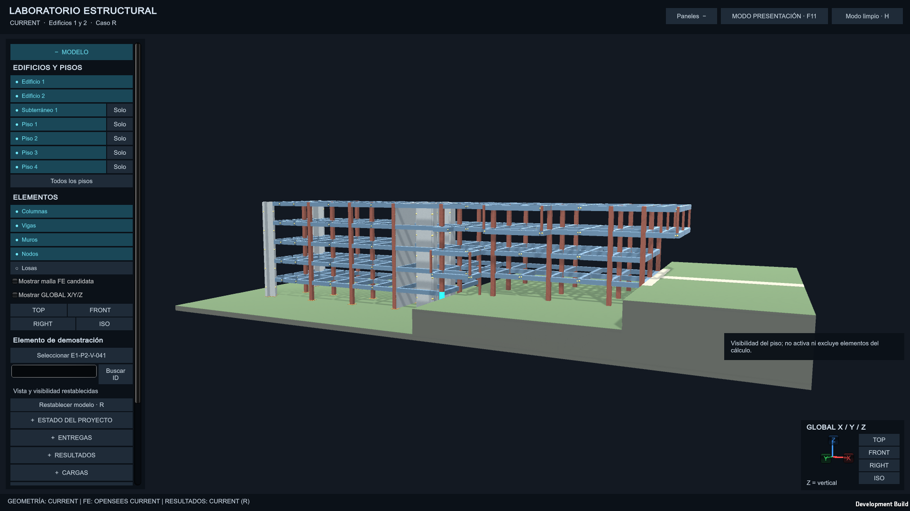  *(1920x1080 px)*

<!-- Página 4 -->

Imagen 2: Edificio visión lateral
Fuente: Elaboración propia, 2026.
Imagen 3: Edificio visión vertical
Fuente: Elaboración propia, 2026.
2.2 La idealización y sus supuestos
El modelo global es un sistema lineal elástico tridimensional escrito en unidades SI: metros, newtons
y pascals. Vigas y columnas son elementos lineales de viga-columna, con la formulación
elasticBeamColumn o forceBeamColumn según el caso, y seis grados de libertad por nodo. Los muros
se modelan como elementos lineales equivalentes de espesor de 0,25 metros, siguiendo la convención
que el curso entregó para esta etapa. Las losas no entran con elementos finitos: su peso y su
sobrecarga se transfieren a las vigas mediante áreas tributarias, que es una simplificación clásica y
suficiente para el objetivo de este proyecto, siempre que la transferencia sea explícita y verificable, y
de eso se trata la sección 4.

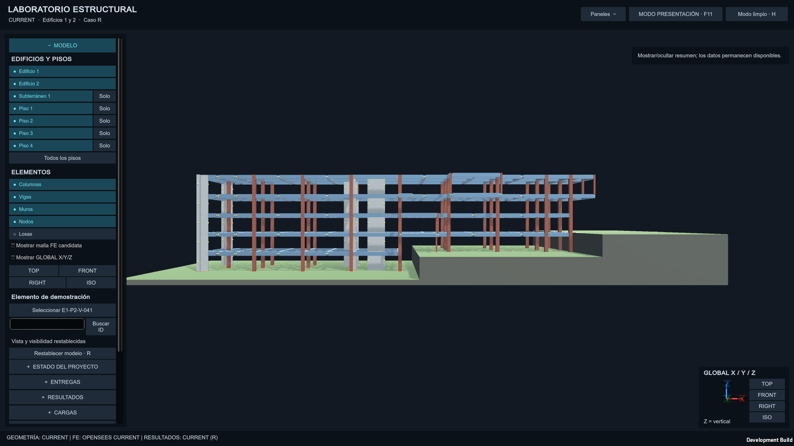  *(1920x1080 px)*

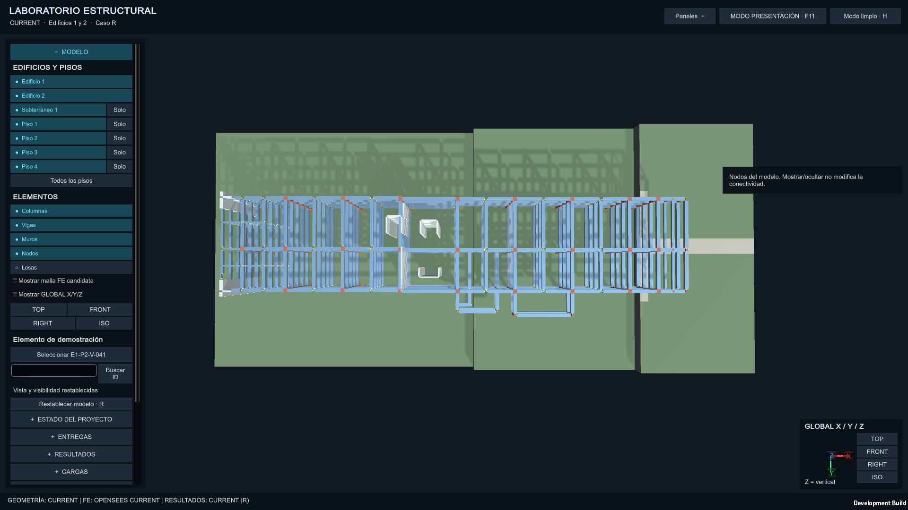  *(1920x1080 px)*

<!-- Página 5 -->

Hay un supuesto que conviene decir con todas sus letras, porque aparece varias veces más adelante: el
modelo global es lineal elástico. No hay no linealidad de material, no hay P-delta, no hay contacto ni
deslizamiento en los apoyos. Eso es suficiente para estudiar reparto de cargas, deformadas, reacciones
y superposiciones, pero no para afirmar nada sobre el comportamiento del edificio ante un sismo real.
La capacidad no lineal que calculamos en las secciones 9 a 12 es un estudio aparte, de sección y de
elemento, y no se inyecta en el modelo global.
2.3 Apoyos, restricciones y diafragmas
La base del modelo queda en cota cero con 33 apoyos empotrados; en cada uno se restringen los seis
grados de libertad, la misma condición que usamos en el caso de referencia de la primera semana con
ops.fix(node, 1, 1, 1, 1, 1, 1). Vale la pena notar que la condición de contorno es idéntica desde el
ejemplo mínimo de una viga hasta el modelo completo: ese fue justamente uno de los propósitos de
ese caso de referencia, poder trazar la misma decisión a través de toda la historia del proyecto.
Sobre los apoyos se imponen cinco diafragmas rígidos, uno por nivel de losa, que acoplan los nodos
de cada planta en su propio plano horizontal. El objetivo del diafragma es que la planta se mueva
como un bloque, que es lo que se espera de una losa conectada. Medimos la compatibilidad numérica
que resulta de esa imposición y quedó en el orden de 2,2e-5 m, es decir, por debajo de cualquier
escala que importe para el resultado.
Imagen 4: Edificio con losas y apoyos encendidos
Fuente: Elaboración propia, 2026.

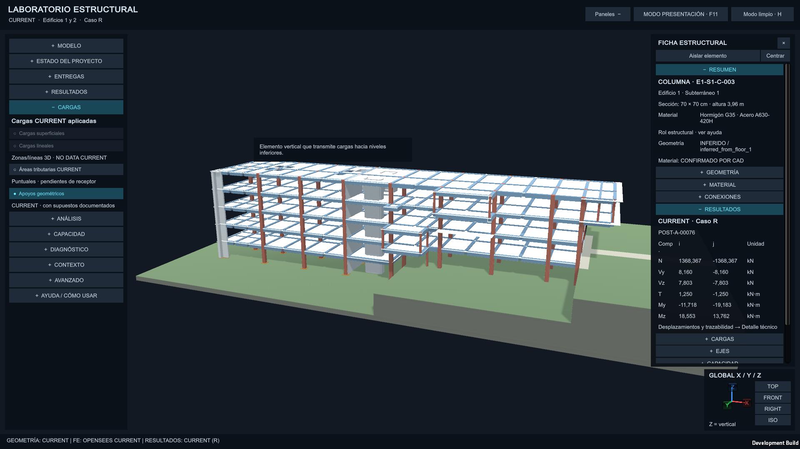  *(1920x1080 px)*

<!-- Página 6 -->

3. Geometría y datos
3.1 Nodos, elementos y grados de libertad
El modelo global de elementos finitos tiene 1170 nodos, cada uno con seis grados de libertad, y 677
segmentos estructurales. De esos segmentos, 673 quedan analizados y ninguno queda aislado: cero
elementos sin camino a un apoyo, que es la comprobación mínima para saber que el modelo está bien
conectado antes de correr cualquier análisis. El punto de control visual del modelo declara 442 vigas,
143 columnas, 84 muros, 10 losas y 33 apoyos visuales.
3.2 La cadena de identidad
Una de las cosas que más trabajo dieron, y que más importa tener resuelta, es saber qué es qué. Un
mismo elemento físico aparece en varios lugares con nombres distintos: tiene un código de ingeniería
, un sólido en la escena del visor, una etiqueta de OpenSees, una etiqueta de nodo en cada extremo y,
en algunos casos, varias etiquetas de análisis. Esa cadena está resuelta en un contrato único de 658
identidades, que corresponden a 625 elementos estructurales más 33 apoyos, con una tabla de
correspondencia que une nodeTag, elementTag y solidTag.
La relación importante es que un elemento físico puede tener más de una etiqueta de análisis: la
correspondencia es de uno a muchos, no biyectiva. Esto se descubrió cuando un código de elemento
no devolvía un solo tag al buscarlo, y obligó a resolver la búsqueda siempre a través de la tabla de
correspondencia y nunca por asumir una identidad directa. Quedó documentado porque es
exactamente el tipo de cosa que rompe una demostración en vivo si alguien pregunta por un elemento
puntual.
3.3 Ejes locales y transformaciones geométricas
Las transformaciones geométricas de los elementos son
referencia
es arbitraria: si el vector de referencia resulta colineal con el eje propio del elemento, OpenSees
rechaza la transformación y el análisis ni siquiera arranca. Nosotros tropezamos con eso en la primera
semana, lo detectamos porque el ejemplo mínimo no corría, y desde entonces el modelo lleva una
verificación explícita de vectores de referencia. Fue uno de los primeros errores del proyecto y quedó
registrado en la sección 18 junto con los demás.
3.4 Formatos de intercambio
La geometría y los resultados viven en archivos JSON y CSV que no dependen de la escena de Unity
en absoluto. Ese es el contrato de intercambio: Unity dibuja lo que los archivos declaran y nada más.
Si mañana cambiamos el motor de visualización, el análisis no se entera; si mañana cambiamos el

<!-- Página 7 -->

modelo, el visor se reconstruye sin que nadie toque una escena a mano. Esta idea parece obvia dicha
así, pero es la que sostiene todo el flujo y conviene recordarla cada vez que aparece una duda sobre
dónde está la verdad del modelo.
Imagen 5: Edificio con IDs técnicos encendidos
Fuente: Elaboración propia, 2026.

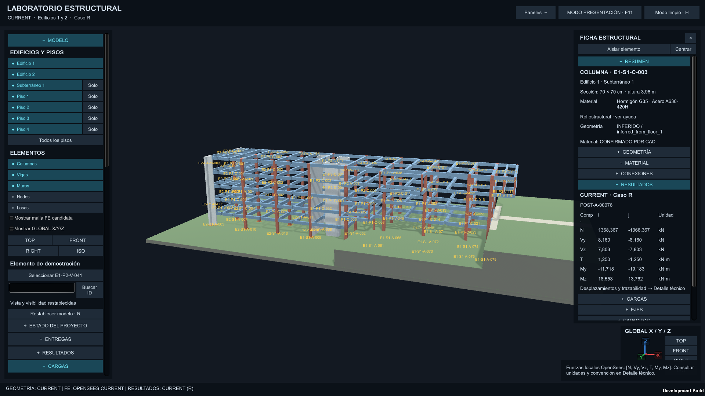  *(1920x1080 px)*

<!-- Página 8 -->

4. Cargas gravitacionales y áreas tributarias
4.1 De dónde sale la carga superficial
La carga superficial q_G reúne el peso propio de la losa más las terminaciones. Trabajamos con dos
valores de referencia que conviene no confundir. En el paño de referencia del caso base de la primera
semana, q_G vale 7,35 kN/m², que sale de sumar 250, 200 y 300 kgf/m² sobre el plano 700. En el
módulo del modelo completo, en cambio, una losa de 15 centímetros de espesor da 4,71 kN/m², y al
aplicarle el factor 1,5 de sobrecarga de terminaciones llegamos a q_G = 6,21 kN/m². Los dos números
conviven en el repositorio porque responden a modelos distintos, y por eso en este informe siempre se
indica de cuál se está hablando.
4.2 Cómo calculamos las áreas tributarias
El cálculo de áreas tributarias es un módulo independiente, con su propio código y su propio conjunto
de pruebas. La idea geométrica es directa: cada vigión se queda con la mitad del paño a cada lado, y la
superficie que le toca es su área tributaria. Lo que hizo falta fue implementarlo con suficiente rigor
como para que las sumas cierren, y ahí es donde entraron las pruebas.
La suite del módulo tiene 62 pruebas automatizadas más 7 verificaciones de calidad. Se comprueba
que los identificadores sean únicos, que las unidades sean SI, que las áreas sean geométricamente
válidas, que la suma de todas las áreas tributarias sea exactamente el área de la losa, que la relación
carga por unidad de longitud por longitud dé la carga puntual que se espera, que el equilibrio global
cierre y que la sobrecarga no se cuele en el caso base de gravedad. Esas pruebas corren en minutos y
son la base de todo lo que viene después: si un reparto de cargas está mal, casi siempre se detecta aquí
y no en el análisis.
4.3 Transferencia explícita de la losa a las vigas
La transferencia se hace con un invariante que se puede comprobar con lápiz y papel: la carga
transferida a una viga es igual a la carga superficial multiplicada por el área tributaria que le
corresponde. Para el bloque A, el área de piso es de 726,75 metros cuadrados; cada uno de los cuatro
pisos típicos aporta 6431,74 kN, y en total 25 726,95 kN. La suma de todas las áreas tributarias del
modelo da 2907,0 metros cuadrados, que es exactamente el área de losa del edificio. El piso 1°S, el
subsuelo, no recibe carga de losa típica: aporta geometría y elementos, pero no tributa.
4.4 Qué verificamos y con qué números
Sobre ese reparto corrimos tres comprobaciones. La primera es la conservación de la suma de cargas,
que cerró con un error de 3,7e-12 kN, es decir, ruido de coma flotante. La segunda es el equilibrio
global: la suma de las reacciones menos la suma de las cargas aplicadas dio 1,5e-11 kN. La tercera fue

<!-- Página 9 -->

más exigente, porque queríamos una verificación que no dependiera del mismo código que produjo el
reparto: hicimos una partición manual tipo Voronoi, asignando a cada columna la superficie cercana a
mano, y comparamos. La suma total coincide con OpenSees, 25 726,95 kN, y la mayor diferencia en
una columna individual fue de 50,0 kN, alrededor del 1,2 %, atribuible a que los dos métodos reparten
distinto en los bordes. Es una discrepancia esperable y honesta, no un error.
Imagen 6: Edificio con áreas tributarias encendidas
Fuente: Elaboración propia, 2026.

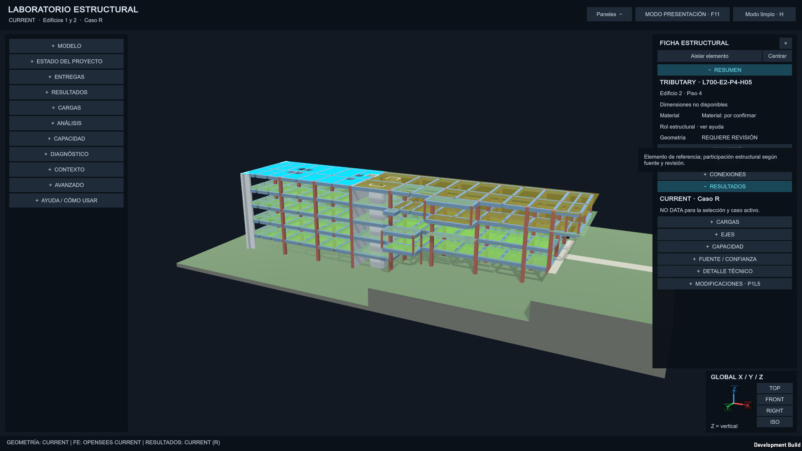  *(1920x1080 px)*

<!-- Página 10 -->

5. Carga viva
5.1 La misma geometría, otra intensidad
La carga viva reutiliza exactamente los mismos polígonos tributarios que la gravedad, con una
intensidad distinta y sin las terminaciones que forman parte de q_G. Reutilizar la geometría no es una
economía de código: es una decisión de coherencia. Si la sobrecarga usara un reparto propio,
podríamos tener dos versiones de la verdad geometrica del piso, y la verificación de conservación
tendría que hacerse dos veces. El piso 1°S queda excluido de la carga viva típica, igual que quedó
excluido de la losa.
5.2 Verificación del invariante para carga viva
La comprobación es la misma que para gravedad, con la intensidad cambiada. En la integración de la
tercera entrega, sobre 110 paños que suman 3392,624 metros cuadrados, la carga viva transferida total
fue de 8317,569065 kN con un error relativo de 1,12e-16. En el modelo actual zonificado, la suma de
reacciones verticales para el caso Q dio 24 636 593,868 N contra los 24 636 593,938 N que se
transfirieron: un residuo de 0,070 N sobre un total de 24,6 MN, o lo que es lo mismo, un error relativo
de 2,8e-9. El desplazamiento máximo bajo este caso es de 38,7 milímetros, notablemente menor que
los 97,3 milímetros de la gravedad, como corresponde a una carga de menor magnitud distribuida de
manera similar.

<!-- Página 11 -->

6. Sismo pseudoestático
6.1 Qué patrón usamos y por qué es un límite
Para la acción sísmica usamos el patrón lateral idealizado que el profesor parametrizó para el curso:
un peso sísmico por nivel multiplicado por un coeficiente basal configurable, con valor base de 0,10.
Es decir, cargamos el edificio con una fuerza horizontal proporcional a su peso en cada planta,
creciendo con la altura. No desarrollamos un procedimiento normativo completo: no hay verificación
de modos de vibración, no hay espectro de diseño, no hay análisis dinámico ni capacidad sísmica.
Decirlo así es importante, porque una flecha lateral sobre un modelo puede confundirse con un estudio
sísmico y no lo es.
Lo que sí hace bien este patrón es servir como caso de carga lateral con el cual probar todo el aparato
de superposición, deformadas y diagramas en una dirección distinta a la vertical. Y de paso permite
visualizar en el visor los vectores de carga lateral, las deformadas asociadas y los centros de masa por
nivel, que son capas útiles para revisar que la carga esté donde debe estar.
6.2 Casos EX y EY con sus comprobaciones
En la integración de la tercera entrega, la fuerza total de cada caso lateral fue de 6384,122192 kN, con
error de corte basal de 3,13e-13 en EX y 7,83e-13 en EY, y error en el punto de aplicación de las
fuerzas de 7,11e-15 m. En la integración final, que ya incluye los dos edificios, el corte basal sube a
17 638,7 kN en cada dirección, un valor coherente con el peso sísmico de 88 194 kN: el producto 88
194 por 0,20 da exactamente ese orden, y la coincidencia es la comprobación rápida de que la
magnitud de la carga está bien dimensionada.
Imagen 7: Edificio con patrón sísmico EX
Fuente: Elaboración propia, 2026.

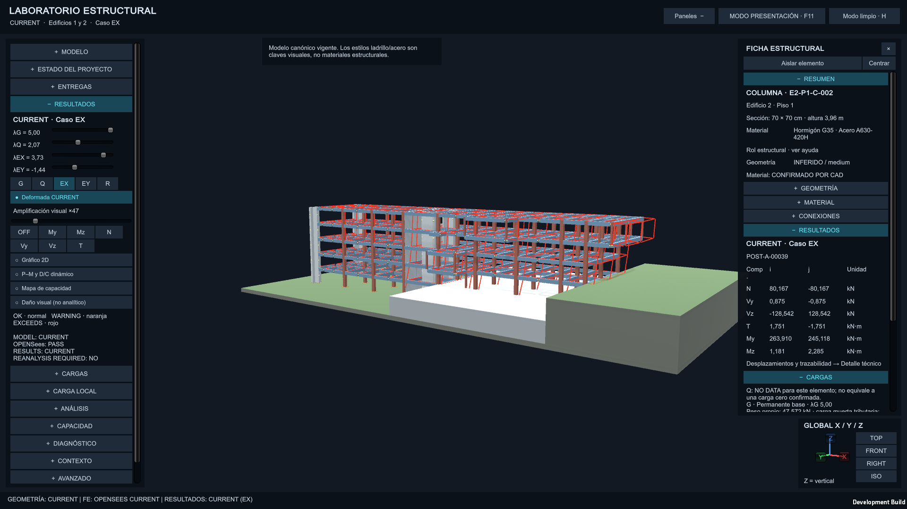  *(1920x1080 px)*

<!-- Página 12 -->

Imagen 8: Edificio con patrón sísmico EY
Fuente: Elaboración propia, 2026.
7. Superposición
7.1 La idea y por qué es barata
Los casos base son cuatro: peso propio, sobrecarga y sismo en cada una de las dos direcciones.
Cualquier combinación de diseño se forma sumando esos cuatro resultados con sus factores
correspondientes, sin volver a correr OpenSees. Esa es la ventaja de haber guardado los casos por
separado: la superposición es una suma ponderada de números ya calculados, y por eso en el visor se
pueden mover los factores en tiempo real y ver la deformada cambiar sin esperar un análisis.
La contraparte de esa comodidad es la responsabilidad: si la superposición estuviera mal
implementada, todas las combinaciones del visor estarían mal al mismo tiempo y nadie se daría cuenta
por simple inspección. Por eso la verificamos contra el camino lento.
7.2 La verificación contra OpenSees, paso a paso
Armamos expresamente en OpenSees la combinación 1,2G + 0,5Q + 1,0EX + 0,3EY, es decir,
corrimos el análisis con esa carga ya combinada, y comparamos los tres resultados clave contra la
suma ponderada de los casos guardados:

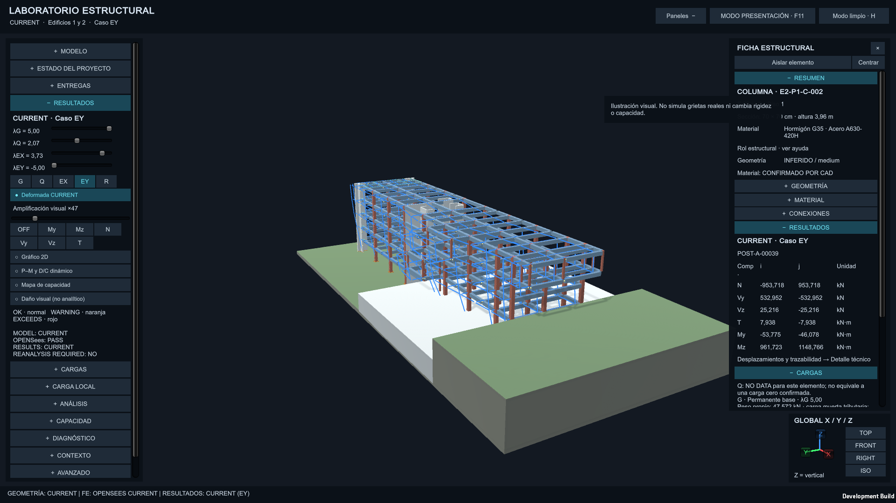  *(1920x1080 px)*

<!-- Página 13 -->

Cantidad Error absoluto Tolerancia Resultado
Desplazamientos 2,41e-12 m 1e-9 Cumple
Reacciones 4,75e-13 kN 1e-9 Cumple
Fuerzas internas 1,30e-12 kN 1e-9 Cumple
Los tres errores están varios órdenes de magnitud por debajo de la tolerancia de 1e-9 que nos
autoimpusimos, lo que significa que la superposición reproduce el análisis directo hasta donde la
aritmética de doble precisión permite. Ampliamos la comprobación en la auditoría de arquitectura
final: con tres combinaciones arbitrarias, no solo la de diseño, el error relativo máximo fue de
1,43e-14.
7.3 Que las combinaciones cierren entre sí
Hay una segunda clase de verificación, más sencilla pero igual de útil: pedirle a la superposición que
sea consistente consigo misma. La suma de los casos G y Q por separado, comparada contra el caso
G+Q corrido como tal, dio un residuo de 1,50e-11 kN en reacciones y 2,4e-18 m en desplazamientos.
Las combinaciones usuales (1,4G; 1,2G+1,6Q; 1,4G+1,4Q) cierran con errores del orden de 1e-12 kN.
Y en la integración de la quinta semana, ya en newtons, los totales quedaron en 109 397 577,792 N
para 1,4G, 133 187 902,582 N para 1,2G+1,6Q y 102 777 720,862 N para G+Q+0,3EX+0,3EY, con el
manifiesto del análisis marcando compatibilidad de superposición lineal y residuos del orden de
1e-15.
8. Análisis global y verificaciones
8.1 Cómo está configurado el análisis
El análisis lineal del modelo global usa una configuración estándar y conocida: numerador RCM,
sistema de bandas general, restricciones por transformación, integrador de control de carga con factor
unitario, algoritmo lineal y una sola llamada a analyze(1). No hay iteración porque el problema es
lineal; tampoco la hace falta. Los diagramas de esfuerzos, en cambio, sí requieren cuidado: en lugar
de muestrear la fuerza en un puñado de puntos, integramos la función analítica del momento a lo largo
del elemento, My(x) = Myᵢ + Vzᵢ·x + 0,5·wz·x², de modo que el diagrama es exacto entre extremos y
no una poligonal de muestras.
| Cantidad | Error absoluto | Tolerancia | Resultado |
|---|---|---|---|
| Desplazamientos | 2,41e-12 m | 1e-9 | Cumple |
| Reacciones | 4,75e-13 kN | 1e-9 | Cumple |
| Fuerzas internas | 1,30e-12 kN | 1e-9 | Cumple |

<!-- Página 14 -->

8.2 Deformadas
El modelo completo, bajo el caso de gravedad, se deforma hasta 97,3 milímetros en su punto más
blando; bajo sobrecarga, 38,7 milímetros. El caso de referencia de la primera semana, que era una
columna individual con carga axial conocida, produjo un acortamiento de −1,080e-5 m, un número
pequeño que tiene la virtud de poder compararse a mano. Las deformadas que muestra el visor se
amplifican con un control deslizante, precisamente porque a escala real no se ven: un edificio de
veinte milímetros de flecha sobre veintisiete metros de planta no se percibe a simple vista, y una de
las tareas de un visor es hacer visible lo que la aritmética ya calculó.
Imagen 8: Edificio con deformada amplificada
Fuente: Elaboración propia, 2026.
8.3 Reacciones y equilibrio
Verificación Valor Resultado
Suma de reacciones verticales
78 141 126.994 N frente a 78
Cumple
contra suma de cargas (modelo
141 127.002 N, residuo 2,8e-7
completo, G)
N
Suma de reacciones en el caso
176,400 kN, error 2,91e-14 Cumple
de referencia 2D de la semana
1
Reacción por columna en ese
44,100 kN Cumple
mismo caso
| Verificación | Valor | Resultado |
|---|---|---|
| Suma de reacciones verticales contra suma de cargas (modelo completo, G) | 78 141 126.994 N frente a 78 141 127.002 N, residuo 2,8e-7 N | Cumple |
| Suma de reacciones en el caso de referencia 2D de la semana 1 | 176,400 kN, error 2,91e-14 | Cumple |
| Reacción por columna en ese mismo caso | 44,100 kN | Cumple |

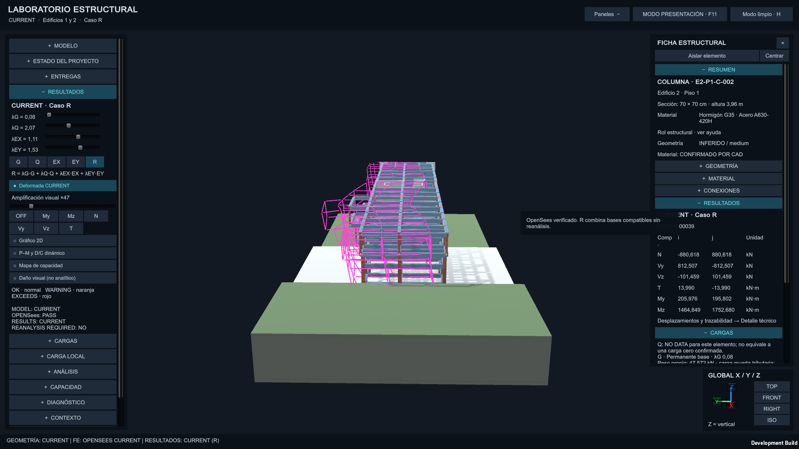  *(1920x1080 px)*

<!-- Página 15 -->

Cierre de cortante y flexión en
1,09e-14 Cumple
el caso de referencia
La primera fila es la comprobación seria del modelo completo: las reacciones suman lo mismo que lo
que se cargó, con un residuo de menos de una millonésima de newton sobre 78 meganeuwtons. Las
tres filas siguientes vienen del caso de referencia, donde además sabemos la respuesta esperada y se
puede verificar a mano.
8.4 Diagramas de esfuerzos
El visor renderiza los cinco esfuerzos internos de mayor interés, axial y los dos cortantes y los dos
momentos, con un selector de componente y el mismo control de amplificación de deformada. Los
diagramas se dibujan sobre la geometría original del elemento, deformada o no según la opción
elegida, y su magnitud sigue el mismo cálculo analítico descrito en 8.1.
8.5 Validaciones automatizadas
Además de las pruebas de unidad, hay validaciones de integración que corren sobre el modelo
completo y que son las que dan confianza al final de cada etapa: auditoría del modelo integrado,
prueba de propagación desde una única fuente de verdad, validación de cargas y resultados vigentes,
validación de completitud de la zona revisada, y las comprobaciones de residuo de los cuatro casos
base, que quedan todas en torno a 1e-15.
| Cierre de cortante y flexión en el caso de referencia | 1,09e-14 | Cumple |
|---|---|---|

<!-- Página 16 -->

9. Secciones de fibras
9.1 La sección de referencia y sus materiales
La sección de referencia es una columna de 0,70 por 0,70 metros, representativa de la torre del bloque
A. El hormigón se modeló con el material Concrete 01 y una resistencia a compresión de 35 MPa; el
acero, con Steel 01 y un límite elástico de 420 MPa. La cuantía que se usó para calcular la capacidad
actual es de 0,015 con recubrimiento de 0,05 metros.
Sobre esos dos últimos números hay que ser claros, porque es el punto donde un lector desprevenido
podría sacar una conclusión equivocada: son supuestos de laboratorio. El estado del archivo lo declara
con la etiqueta
armado definitivos del edificio y por lo tanto no podemos afirmar que la cuantía real sea esa. Lo que sí
podemos es decir qué capacidad daría esa sección, y eso es lo que calculamos. Cuando en la sección
12 aparezcan relaciones demanda-capacidad por encima de uno, este párrafo es la primera parte de la
explicación.
9.2 Cómo discretizamos la sección
La sección se divide en una malla de 28 por 28 fibras de hormigón, distinguiendo las fibras confinadas
por el recubrimiento de las que no lo están, más 12 barras de 25 milímetros de diámetro dispuestas en
el perímetro. Cada fibra lleva su propio material y su deformación se calcula a partir del campo de
deformaciones planas de la sección, que es la hipótesis clásica de Bernoulli: las secciones permanecen
planas. Los programas que hacen este trabajo son section_model.py, pm_interaction.py y
moment_curvature.py, y la traza gráfica de la discretización se publica como fiber_section.png.
9.3 Qué representa y qué no representa este modelo
La sección de fibras representa el comportamiento axial-flexural de la sección: cómo resiste
combinaciones de fuerza normal y momento flector, hasta donde los materiales llegan. No representa
capacidad de corte, ni inestabilidad del elemento (pandeo, acortamiento efectivo), ni la respuesta no
lineal global del edificio, ni falla por adherencia entre acero y hormigón, ni pandeo de las barras.
Puede haber un elemento que pase la verificación de flexión y aun así tener un problema de corte: este
modelo no lo diría. Mantener esa frontera clara entre lo que el cálculo cubre y lo que no es, en nuestra
opinión, la parte más importante de esta sección del informe.

<!-- Página 17 -->

Imagen 9: Sección transversal columna
Fuente: Elaboración propia, 2026.
10. Relación momento-curvatura
10.1 La curva y su lectura
La curva momento-curvatura describe cómo va perdiendo rigidez una sección a medida que se la
fuerza a doblar. Para la columna de 0,70 por 0,70 metros bajo carga axial nula, el análisis de 240 pasos
dio un momento máximo de 766,08 kN·m alcanzado en una curvatura de 0,03106 por metro, con
todos los pasos en estado aprobado. La curva completa, con sus 240 pares de puntos, está publicada en
entregas/P1L3/capacidad_ha/results/moment_curvature.csv
Leer la curva implica tres cosas: la pendiente inicial es la rigidez a flexión de la sección en gama
elástica; el punto máximo es la capacidad última a flexión pura; y la zona posterior al máximo, si
existe, es el ablandamiento por fractura del hormigón. Para una sección sin armadura de
confinamiento seria, ese tramo final es corto, y por eso el diseño se apoya en el pico.

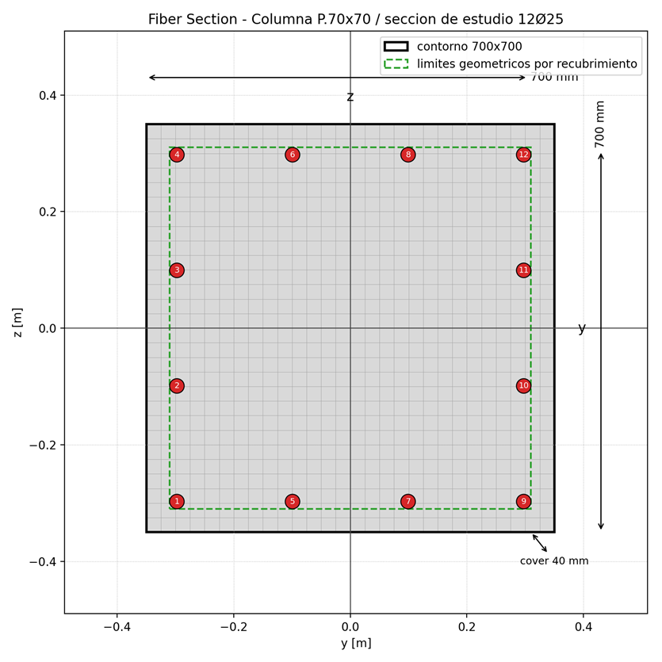  *(835x835 px)*

<!-- Página 18 -->

Imagen 10:
Fuente: Elaboración propia, 2026
10.2 Validación independiente
Lo que sí verificamos fue la convergencia interna del propio análisis, 240 pasos sobre 240
completados, y esa comprobación es necesaria pero no suficiente. Este punto queda abierto en el
informe en lugar de presentarse como resuelto, y es uno de los tres pendientes que enumeramos al
final de la sección 21.
11. Envoltura de interacción axial-momento
11.1 Columna
La envoltura de interacción de la columna de 0,70 por 0,70 metros se calculó en 13 niveles de carga
axial, de la flexión pura a la compresión pura. Los valores representativos de esa curva son:
Estado axial Momento máximo
Flexión pura (P = 0) 766,08 kN·m
P = 4873 kN 1696,45 kN·m
P = 9746 kN 1650,07 kN·m
| Estado axial | Momento máximo |
|---|---|
| Flexión pura (P = 0) | 766,08 kN·m |
| P = 4873 kN | 1696,45 kN·m |
| P = 9746 kN | 1650,07 kN·m |

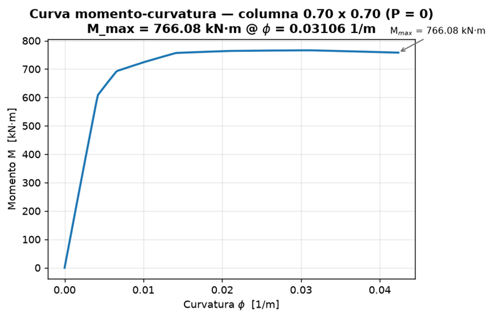  *(836x539 px)*

<!-- Página 19 -->

Compresión pura 19 492,25 kN
La forma de la curva es la esperada para una sección de hormigón armado: al principio, agregar
presión axial aumenta la capacidad de momento, porque la compresión ayuda a que el hormigón
trabaje; pasado cierto punto, la compresión domina y la capacidad de momento vuelve a caer, hasta
desaparecer en la compresión pura. El hecho de que la curva tenga esa forma, con su máximo
desplazado hacia la izquierda, es la primera comprobación cualitativa de que el cálculo de fibras se
comporta como debe. Los datos completos están en
entregas/P1L3/capacidad_ha/results/pm_interaction.csv.
Imagen 11:
Fuente: Elaboración propia, 2026.
11.2 Muro
El muro se trató por separado, con su propia envoltura y con 14 puntos de cálculo, todos completados
en 260 de 260 pasos. Los puntos de referencia son: 13 148,97 kN·m de momento en flexión pura, 16
378,95 kN·m con una compresión de 1484 kN, y 32 943,23 kN·m cuando la compresión sube hasta el
| Compresión pura | 19 492,25 kN |
|---|---|

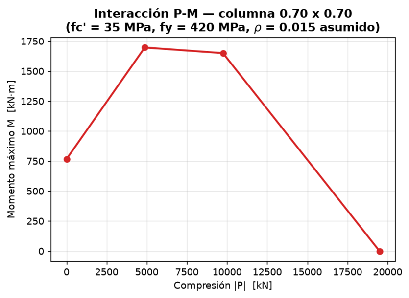  *(835x610 px)*

<!-- Página 20 -->

entorno de los 14 840 kN. La curva está publicada en
entregas/P1L4/demanda_capacidad/results/wall_pm_interaction.csv.
La comparación entre columna y muro es por sí misma ilustrativa: el muro, con su base mucho más
ancha, alcanza momentos del orden de diez veces mayores en los mismos niveles de compresión. Es
la razón estructural por la que la caja de muros del bloque B es la que resiste las acciones laterales, y
la torre de columnas del bloque A la que gravita.
Imagen 12:
Fuente: Elaboración propia, 2026.
11.3 Comparación independiente con el curso de hormigón armado
Igual que en 10.2, esta comparación no existe todavía en el repositorio y la declaramos como
pendiente. Preferimos decirlo de esta manera antes que transcribir un número que no haya sido
obtenido de forma independiente.
12. Demanda y capacidad
12.1 De dónde sale la demanda
Hasta aquí la capacidad se estudió elemento por elemento, con cargas inventadas para sondear la
curva. La demanda, en cambio, sale del modelo global: el programa generar_demanda_capacidad.py
toma los esfuerzos de los cuatro casos base, arma la combinación de envolvente y proyecta el par (P,
M) de cada elemento vertical sobre su envoltura de interacción, tanto por el eje de momento menor

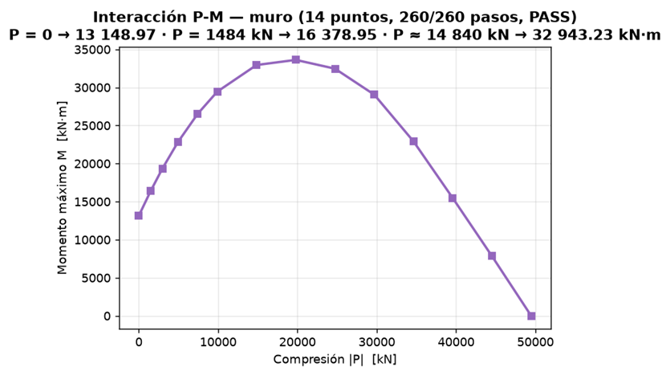  *(835x467 px)*

<!-- Página 21 -->

como por el de momento mayor. El resultado es un archivo con 669 registros de capacidad para 173
elementos verticales, organizados en 7 familias de sección: 128 columnas de 0,70 por 0,70, 13 de 0,35
por 0,35, 2 de 0,20 por 0,20 y 4 familias de muro, con 6 puntos de capacidad por curva.
12.2 Qué muestran los números
Tome­mos el elemento de referencia E1-P1-C-001, una columna de la familia 0,70 por 0,70: su
relación demanda-capacidad es 0,008279, es decir, trabaja al 0,8 % de su capacidad, muy dentro de la
envolvente. Al recorrer los 173 verticales, 163 tienen relación calculada; de esos, 94 quedan por
encima de uno; el peor caso es E1-S1-C-009 con una relación de 5,253; y 10 elementos quedaron
marcados explícitamente como fuera de rango, sin silenciarlos ni esconderlos.
La gráfica siguiente muestra todos los puntos de demanda contra la envoltura de capacidad de la
columna, con los que superan la capacidad marcados en rojo.
Imagen 13:
Fuente: Elaboración propia, 2026.
12.3 Cómo se interpreta esto correctamente
La primera explicación  es la que ya anticipamos en la sección 9: la capacidad se calculó con cuantía y
recubrimiento supuestos, no con los del proyecto definitivo. Si la armadura real resulta mayor, la
capacidad sube y muchas de esas relaciones bajan de uno. La segunda es que la capacidad es de
sección y solo de sección: no incorpora corte ni comportamiento de elemento.

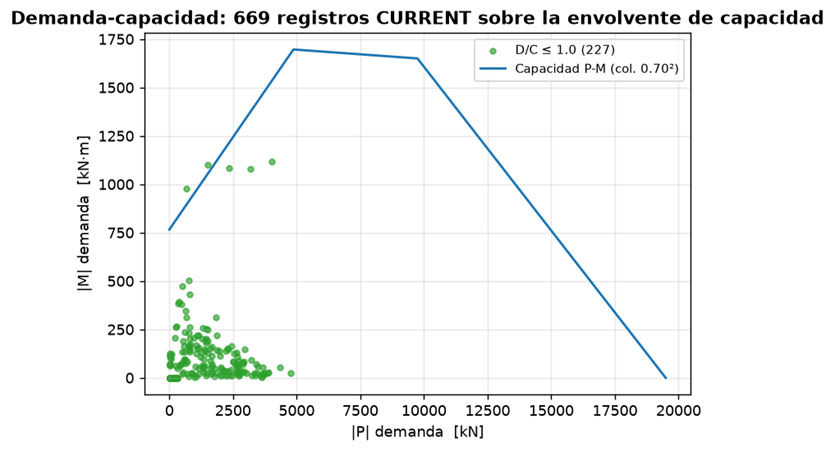  *(835x451 px)*

<!-- Página 22 -->

Además hay una limitación propia del conjunto de datos de realidad aumentada que conviene
registrar: la envolvente de demanda en ese archivo figura en cero en todos los registros. Es una
limitación conocida del generador, declarada desde la etapa de integración, y no fue corregida en este
cierre porque afecta a los datos que consume el teléfono, no a los que sustentan este informe.
13. Unity como preprocesador y postprocesador
13.1 Arquitectura y flujo de datos
El flujo de datos del proyecto tiene cuatro eslabones y conviene enunciarlos con palabras, no con
flechas. OpenSeesPy ejecuta el análisis y produce resultados por caso. Esos resultados, junto con la
geometría y la tabla de identidad, se serializan en archivos JSON y CSV, que son el contrato de datos.
Unity lee ese contrato y construye la vista: dibuja, selecciona, muestra, deforma. Y la realidad
aumentada toma esa misma vista, la transforma al sistema de coordenadas del mundo real y la
proyecta sobre el edificio.
La regla que se desprende de ese orden es que modelo_central es la única fuente de verdad. Las
entregas históricas no se sobrescriben, cada integración conserva su copia, y Unity no calcula
resultados estructurales de ningún tipo. Si alguien abre la escena y mueve un elemento a mano, la
próxima vez que se regenere desde los archivos, el cambio desaparece; eso puede parecer una
limitación hasta que uno se da cuenta de que es exactamente lo que garantiza que la escena y el
análisis nunca diverjan.
El flujo completo puede resumirse en una sola frase: OpenSeesPy analiza; los archivos guardan; Unity
muestra; y el teléfono ubica.
13.2 Qué se hace en el preproceso
Antes de que exista una imagen que mostrar, hay una etapa de preparación que también ocurre dentro
de Unity: tablas de identidad, generación y validación del conjunto de datos, inspección de la
geometría de los 658 elementos (625 estructurales más 33 apoyos), diagnóstico de conectividad
mediante colores, donde un elemento desconectado se ve distinto de inmediato, y un control de
calidad visual previo a la exportación. Esa etapa existe porque los errores de datos son más baratos de
detectar en el escritorio que en el dispositivo.
13.3 Qué se hace en el postproceso
La parte que ve el usuario incluye la selección de casos (peso propio, sobrecarga, sismo en ambas
direcciones y cualquier combinación armada), la deformada con amplificación, los diagramas por
componente, un gráfico bidimensional de la respuesta, las envolturas de interacción con el punto de

<!-- Página 23 -->

demanda encima, capas de carga, de apoyos, de ejes, de centros de masa y la lectura del corte basal.
Todo eso se construye encima de los mismos datos; nada se deriva de la escena.
13.4 Por qué la escena no es la fuente de verdad
Esta idea merece su propio párrafo porque es la que sostiene la coherencia entre los dos visores. Como
los datos viven fuera de Unity y la escena se reconstruye desde archivos, el mismo conjunto de datos
alimenta al visor de escritorio y al visor móvil sin ninguna adaptación. Un cambio en el JSON
regenera la vista entera sin que nadie abra un editor de escenas. Y el teléfono, que es donde menos
potencia de cálculo hay, no necesita recalcular nada: carga un archivo de unos 11 MB que se genera
en el escritorio, igual que cualquier otro, y lo muestra.
14. Visualización de apoyos, cargas, ejes y diagramas
14.1 Apoyos y restricciones
El visor distingue entre apoyos geométricos, que son los del modelo maestro, y apoyos de elementos
finitos, que son los que realmente tienen grados de libertad restringidos. Además ofrece un modo de
mostrar solo problemas, pensado para encontrar enseguida un apoyo mal colocado o duplicado sin
tener que recorrer la planta entera.
14.2 Cargas aplicadas
Hay capas separadas para cargas superficiales, cargas lineales sobre elementos, el patrón lateral
sísmico, la masa o peso por nivel y las cargas del plano 700. Estar separadas importa: la revisión más
común durante el desarrollo era apagar todas las capas, encender una sola y confirmar que la carga
aparecía donde el plano decía que debía aparecer.
14.3 Ejes locales e identificadores
Se pueden mostrar los ejes locales y global en tres direcciones, las referencias y ejes del CAD de
origen, los identificadores técnicos de cada elemento y una búsqueda directa por etiqueta. La

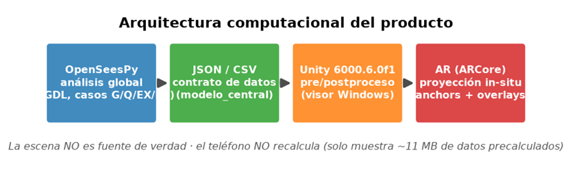  *(835x268 px)*

<!-- Página 24 -->

búsqueda es la forma más rápida de rastrear un elemento concreto: se escribe el código, el visor lo
localiza a través de la tabla de identidad y resalta el elemento con todos sus datos a la vista.
14.4 Deformada y diagramas
La deformada se amplifica con un control deslizante que va de 1 a 250 veces, y el diagrama de
esfuerzos se elige entre las seis componentes disponibles más la opción de apagarlo. Hay además
deformadas específicas por caso lateral, lo que permite comparar de un vistazo la respuesta en X
contra la respuesta en Y. El gráfico bidimensional acompaña al diagrama para quienes prefieran leer
números antes que formas.
14.5 Los catorce interruptores que pide el enunciado
El enunciado de la semana pedía un conjunto mínimo de interruptores de visualización. Los revisamos
uno por uno contra el visor actual y este es el estado real de cada uno:
Elemento exigido Estado en el visor
1 Nodos Implementado
2 Vigas Implementado
3 Columnas Implementado
4 Muros Implementado
5 Diafragmas Implementado (capa de malla y
diagnóstico)
6 Apoyos y restricciones Implementado
7 Ejes locales Implementado
8 Identificadores Implementado
9 Áreas tributarias Implementado (capa
Tributarias)
10 Cargas aplicadas Implementado
11 Deformada Implementado
12 Diagramas de esfuerzos Implementado
13 Indicadores de
Implementado (envoltura y
demanda-capacidad
relación dinámica)
|  | Elemento exigido | Estado en el visor |
|---|---|---|
| 1 | Nodos | Implementado |
| 2 | Vigas | Implementado |
| 3 | Columnas | Implementado |
| 4 | Muros | Implementado |
| 5 | Diafragmas | Implementado (capa de malla y diagnóstico) |
| 6 | Apoyos y restricciones | Implementado |
| 7 | Ejes locales | Implementado |
| 8 | Identificadores | Implementado |
| 9 | Áreas tributarias | Implementado (capa Tributarias) |
| 10 | Cargas aplicadas | Implementado |
| 11 | Deformada | Implementado |
| 12 | Diagramas de esfuerzos | Implementado |
| 13 | Indicadores de demanda-capacidad | Implementado (envoltura y relación dinámica) |

<!-- Página 25 -->

14 Curvas de interacción Implementado (histórica y
actual)
La tabla no es decorativa: cada fila corresponde a una comprobación que hicimos abriendo el visor y
confirmando que el interruptor existe, que hace lo que dice y que no rompe nada de lo demás.
15. Modificación del modelo
15.1 Dos familias de parámetros modificables
El enunciado pedía al menos dos familias de parámetros que se pudieran modificar siguiendo el ciclo
completo de dato, modelo, análisis, resultados y visor. Documentamos dos.
La primera familia es la geometría de carga y su intensidad. El caso concreto que recorrió ese ciclo
completo fue la resolución de la carga de línea de la zona E2-P4: una tira sintética de un metro de
ancho que hizo falta para darle ruta de transferencia a receptores que no la tenían, con lo que esa zona
pasó de 44 a 46 paños. El cambio quedó registrado en el archivo de cargas con la marca
review_resolution y su verificación correspondiente: el residuo de conservación después del cambio
fue de 0,027 N en gravedad y de 0,0 N en sobrecarga. Además de esa corrección geométrica, la
familia incluye los controles deslizantes de intensidad de sobrecarga, que admiten factores de 0,50 a
2,00.
La segunda familia es la capacidad y la sección. El ejemplo ejecutado fue la ampliación del cálculo de
envolturas hasta los 173 elementos verticales, junto con correcciones puntuales de clasificación de
sección, como el caso de E1-P1-C-023, que estaba declarada con una sección distinta a la que le
correspondía y quedó corregida a la sección rectangular de 0,70 por 0,70.
15.2 Cambios que no exigen volver a analizar
Hay una sola clase de cambio que puede hacerse en el momento, sin reanalizar nada: la reponderación
de los cuatro casos base con los controles deslizantes de factores, que admiten valores entre menos 1,5
y más 1,5. Como la superposición lineal se verifica numéricamente, mover un factor es una suma de
arrays ya calculados, y por eso la deformada se actualiza en tiempo real. Este es el punto del sistema
donde la decisión de separar casos base rinde su fruto más visible.
15.3 Cambios que sí exigen reanalizar
Todo lo demás: apoyos, secciones, módulo de elasticidad, conectividad, retirada de elementos y
cualquier cambio en la geometría de carga que altere los casos base. Un ejemplo ejecutado de
principio a fin fue la reposición geométrica del elemento E1-P3-V-101 en las coordenadas [67,841;
| 14 | Curvas de interacción | Implementado (histórica y actual) |
|---|---|---|

<!-- Página 26 -->

16,331; 15,44], con el reanalisis posterior y la regeneración de resultados. La distinción entre ambas
familias es la que conviene tener presente: recombinar es instantáneo, recomputar exige volver al flujo
completo.
15.4 Qué tan reproducible es ese flujo
Para que el ciclo no dependa de pasos manuales olvidables, dejamos dos utilidades de consola:
Proyecto.bat, con los subcomandos de estado, rutas y validación, y Validar_Modelo.bat. Ambas
permiten regenerar y verificar el estado del modelo sin alterar geometría ni cargas. La limitación, que
la decimos sin rodeos, es que la modificación de parámetros estructurales no ocurre dentro del visor:
se hace en los archivos de datos y se regenera. Es un flujo manual, pero es manual de punta a punta y
queda documentado, que es lo que hace falta para que otro lo pueda repetir.
16. Realidad aumentada
16.1 Sobre qué se apoya
La experiencia de realidad aumentada corre sobre ARCore mediante AR Foundation, y su mecanismo
central es el seguimiento de imagen: el teléfono reconoce una lámina impresa que sirve de referencia
y, a partir de ella, estima la posición y la orientación de la cámara respecto del mundo. El sistema
maneja tres estados de seguimiento: no detectado, precisión reducida y seguimiento pleno. Cuando el
estado deja de ser confiable, los elementos se ocultan en lugar de mostrarse en una posición dudosa.
Esa fue una decisión de diseño discutida y mantenida: preferimos que el modelo desaparezca antes
que aparezca corrido, porque un modelo corrido invita a lecturas erróneas de la maqueta.
16.2 De OpenSees a Unity y de Unity al mundo real
Hay dos transformaciones en el camino y conviene no mezclarlas. La primera es la que relaciona la
convención del modelo, con el eje vertical en z, con la convención del visor, con el eje vertical en y:
es una rotación fija de menos noventa grados alrededor del eje X, que en matriz es M =
[[1,0,0],[0,0,1],[0,−1,0]], con su inversa p_model = [X, −Z, Y], que es simplemente la traspuesta por
tratarse de una rotación propia. La segunda transformación es la que aplica la pose que el motor de
realidad aumentada estima para la lámina: una rotación que llega como cuaternión, una traslación y la
escala.
El programa test_ar_transform.py verifica 20 trayectos de ida y vuelta entre sistemas, con errores por
debajo de 1e-9, comprobando distancias, ángulos y además quiralidad, es decir, que el modelo no
aparezca reflejado. Que la comprobación incluya quiralidad no es un detalle: una rotación propia

<!-- Página 27 -->

conserva la mano del sistema, y si en algún paso se introdujera una reflexión, la verificación de
quiralidad es la que lo detectaría.
16.3 Marcadores, anclas y superposiciones de resultados
Las escalas disponibles son una automática y las convencionales de 1 a 10, 1 a 5, 1 a 2 y 1 a 1. La
automática toma la dimensión mayor del elemento y aplica un factor de 0,65, lo que equivale
aproximadamente a 1 a 5,34 en una viga y a 1 a 6,09 en columnas y muros; los límites se verificaron
con una tolerancia de 0,00005 metros.
Sobre el elemento ya colocado, la superposición de resultados dibuja las seis componentes de esfuerzo
con una amplitud máxima de 0,20 metros, separadas 0,015 metros de la superficie, con un grosor de
0,003 metros y una opacidad de 0,35, usando una paleta fija de seis colores. Estos números están
fijados a propósito: con una amplitud libre, un mismo esfuerzo se vería distinto en dos tomas y
alguien podría leer una diferencia donde no la hay.
16.4 La prueba en el dispositivo
La colocación, los tipos de elemento (viga, columna y muro), las anclas, las acciones de recolocación
y cancelación, las escalas y la paleta fueron validados en un dispositivo Android físico el 5 de octubre
de 2026. El paquete final es BuildsAndroid/AR_Final_Colors_2026-10-05.apk, de 75 877 201 bytes,
con resumen SHA256 C094CEE4…A6091 y firma del tipo APK v2.
La cobertura del conjunto de datos es de 446 de 446 elementos tipo viga, 142 de 143 columnas y 84
de 84 muros. El caso de prueba de punta a punta, E1-P1-C-010, devuelve un axial envolvente de 2698
kN, momentos de 17,9 y 21,3 kN·m y un desplazamiento máximo de 1,58 milímetros entre las dos
lecturas. Hay una excepción documentada, el elemento E2-P4-C-008, que solo admite diagrama
bidimensional porque su eje de elementos finitos es oblicuo y el desplazamiento asociado, de 31
milímetros, supera los 2 milímetros de tolerancia admitidos. Preferimos declarar esa excepción antes
que forzar el ajuste.
17. Misiones secundarias implementadas
17.1 SQ1, inspector de áreas tributarias
Implementado. Agrega al visor un inspector de áreas tributarias con la capa "Tributarias", que al
seleccionar una viga muestra el área que le corresponde y la carga asociada. Es la pieza que cierra el
circuito de la sección 4 desde la interfaz: lo que antes solo se podía comprobar en la consola, ahora se

<!-- Página 28 -->

ve en la planta. El código vive en
del visor.
17.2 SQ2, explorador de combinaciones de carga
Implementado. Son los cuatro controles deslizantes de factores, con rango de menos 1,5 a más 1,5,
que arman la combinación en vivo a partir de los cuatro casos base, acompañados de la deformada y
de las reacciones resultantes. Es la demostración más directa de la superposición lineal: si la suma
estuviera mal, la deformada dejaría de cuadrar con lo que la suma de reacciones dice, y eso se ve sin
cálculo.
17.3 SQ3, explorador de capacidad de sección
Implementado. Muestra la envoltura axial-momento y la relación demanda-capacidad de los 173
elementos verticales en sus 7 familias, con un conmutador que alterna entre la envoltura histórica y la
actual. Es la sección 12 puesta en pantalla, con la ventaja de poder recorrer elemento por elemento en
lugar de leer un archivo.
17.4 Verificaciones de las misiones
Las tres implementadas comparten el mismo tipo de comprobación. En SQ1, la suma de áreas
tributarias sigue siendo exactamente el área de la losa, con la suite del módulo de gravedad corriendo
sobre el resultado que el inspector muestra. En SQ2, las reacciones de las combinaciones usuales
cierran con residuos del orden de 1e-15. En SQ3, las capacidades del archivo coinciden
numéricamente con las calculadas en la integración. Y en la resolución de receptores de la zona
E2-P4, el residuo de conservación se mantuvo en 0,027 N en gravedad y 0,0 N en sobrecarga.

<!-- Página 29 -->

18. Aseguramiento de calidad y pruebas
18.1 Qué pruebas tiene el repositorio
El módulo de gravedad y áreas tributarias carga con 62 pruebas automatizadas y 7 verificaciones de
calidad, todas en estado aprobado. La transformación de realidad aumentada tiene sus 20
verificaciones de ida y vuelta. Los conjuntos de pruebas de realidad aumentada de la séptima entrega,
que cubren escalas, colocación sobre superficie, colocación libre, superposiciones y diagramas, suman
1200 actualizaciones fijas, 400 por tipo, y 72 capturas de editor, y se ejecutan con el script
RunChecks.ps1.
A eso se suma la auditoría de arquitectura final, que es la comprobación más amplia del proyecto: 19
pruebas, 45 muros del núcleo y 117 resúmenes de verificación del visor de escritorio, todos en estado
aprobado, con las 669 capacidades numéricamente idénticas a las del archivo publicado y un error de
superposición máximo de 1,43e-14. Cuando esa auditoría queda en verde, el proyecto está en un
estado que se puede mostrar.
18.2 Puntos de control
Además de las pruebas, congelamos el estado en puntos de control fechados:
FINAL_AR_CHECKPOINT_2026-10-05.md y sus hermanos de escala, colores y sincronización con
el repositorio. Cada uno registra cifras y resúmenes de verificación, de modo que si más adelante
alguien pregunta en qué estado estaba la realidad aumentada en esa fecha, la respuesta está escrita y
no depende de la memoria de nadie.
18.3 Los errores que encontramos y cómo terminaron
Un informe final que solo enumera lo que salió bien no sirve para nada. Estos son los errores que
detectamos, todos ellos después de haberlos cometido o de que alguien los introdujo, y todos
corregidos:
OpenSees rechaza y que hizo fallar el ejemplo mínimo de la primera semana. Se corrigió y se
verificó desde entonces con comprobación explícita de vectores.
con la tira sintética de un metro y la marca de revisión correspondiente quedó en el archivo de
cargas.
congeló y quedó auditable en los puntos de control.
compilaba. Se regeneró la caché y se incorporó el paquete de interfaz con sus metadatos.

<!-- Página 30 -->

· La protección de compilación para Android eliminada del constructor correspondiente, lo
que hacía que el código no compilara en máquinas sin el módulo de Android instalado. Se
restauró.
·       Un nombre de espacio de nombres faltante en el método de compilación, que producía un
error de método inexistente. Se corrigió la invocación con el nombre calificado.
18.4 Verificación de la compilación y del visor
La compilación para Windows de 64 bits termina con el mensaje de verificación del proyecto en
estado aprobado y con resultado de compilación exitoso. La compilación para Android usa IL2CPP
con firma APK v2 y registra el mensaje de éxito en el registro del editor, fechado el 5 de octubre de
2026 a las 00:30:31. Ambas son parte del entregable: un informe que describe un producto que no
compila no es un informe de un producto.
19. Limitaciones
19.1 Alcance del modelo global
El modelo global es lineal elástico: no hay no linealidad de material ni efectos de segundo orden. Hay
6 cargas puntuales del plano 700 que no pudieron ubicarse en el archivo de referencia, y decidimos
mantenerlas activas y documentadas en lugar de inventarles una posición, porque una carga mal
ubicada es peor que una carga declarada como no ubicada. El piso 1°S no recibe carga de losa típica,
por las razones explicadas en la sección 4.
19.2 Qué no representa la sección de fibras
La capacidad que calculamos es de sección y de tipo axial-flexural. No cubre corte, ni inestabilidad de
elemento, ni la respuesta no lineal global del edificio, ni falla por adherencia, ni pandeo de barras. Y
como ya se dijo dos veces, se calculó con cuantía y recubrimiento supuestos. Cualquier lectura de la
relación demanda-capacidad debe hacerse con esas advertencias presentes.
19.3 La acción sísmica
Es una carga lateral estática idealizada con un coeficiente configurable. No hay análisis modal, ni
espectral, ni dinámico. Las deformadas que se ven en las integraciones intermedias del proyecto no
son la demanda de diseño, y no deberían leerse como tal.

<!-- Página 31 -->

19.4 Realidad aumentada y experiencia de usuario
La envolvente de demanda del conjunto de datos de realidad aumentada está en cero, como se explicó
en la sección 12. La validación física en el dispositivo de las escalas y la paleta de colores quedó
pendiente en el momento de cierre, aunque la base de colocación sí está validada. Y la modificación
estructural no ocurre dentro del visor, sino en los archivos, con regeneración posterior.
20. Uso de inteligencia artificial
20.1 Qué se le delegó
El registro completo está en d
se usó para la extracción de archivos DXF, el módulo de gravedad y su aseguramiento de calidad, los
distintos visores, la integración de la tercera entrega, la funcionalidad de demanda-capacidad, la
resolución de receptores de la zona E2-P4, el flujo completo de realidad aumentada y la
reorganización del repositorio.
20.2 Qué salió mal
También quedó registrado. El agente introdujo transformaciones geométricas inválidas, eliminó una
protección de compilación que hacía falta, trabajó sobre paquetes de Unity desprovistos de sus
metadatos, calificó mal un nombre de espacio de nombres de compilación y generó discrepancias de
conteo entre conjuntos de datos. En todos los casos la detección fue humana y la corrección se hizo
con revisión y con pruebas.
20.3 Las reglas que se le impusieron
Están escritas en AGENTS.md: verificar equilibrio, unidades, ejes locales y superposición antes de
dar por buena cualquier modificación; no tocar los archivos de referencia de Luis, con un contador
que lo hace verificable; y exigir criterios de aceptación numéricos por cada encargo, por ejemplo
"sumar las cargas transferidas con una tolerancia de 1e-10". Sin un criterio numérico, una tarea
delegada no tiene forma de terminar, solo de aparentar que terminó.
20.4 Lo que el agente hizo y lo que no
El agente escribió código, diagnosticó problemas de compilación y automatizó comprobaciones. La
verificación numérica y la aprobación de resultados fueron humanas, y cada cambio relevante llegó
acompañado de su prueba. Esa es la frontera que nos pareció correcta mantener: la máquina acelera,
pero el criterio de aceptación lo pone la persona.

<!-- Página 32 -->

20.5 Registro y trazabilidad
El flujo de trabajo fue por incidencias: plan, compilación, prueba, revisión e integración, con
AGENTS.md como reglas del proyecto, un registro semanal de uso de inteligencia artificial y
confirmaciones con mensaje por tarea. La limitación que declarabamos es que el repositorio no
almacena métricas de las incidencias ni de las solicitudes de incorporación de GitHub, y por eso no se
citan cifras de esas herramientas.
21. Contribución individual
Síntesis a partir del historial de commits del repositorio
Estudiante Contribuciones Módulo revisado Error detectado Concepto aprendido
Matías Stierling
Restructuró y ordenó el repositorio; consolidó los módulos de análisis/Fiber sin tocar resultados; QA del cierre WEEK7 (clon limpio, preservación de contratos, precisión qQ).
Repositorio/versión e integración (analysis + viewer).
Doc obsoleta, intervalos incompletos de la curva Fiber, gate del Editor de Unity, precisión qQ degradada tras restauración.
Reproducibilidad y no alterar baselines sin justificación.
José Lobos Modelo FE completo; sismo EX/EY y pipeline G/Q/EX/EY/R (sup. err 1e-12); exportador de resultados y D/C en viewer; asserts de verificación; informes semanas 2/5/6.
Análisis FE, QA automatizado y pipeline.
Sección E1-P1-C-023 y coordenada E1-P3-V-101; rutas de carga E2-P4; codificación UTF-8; capacidad histórica desalineada (recálculo D/C 0.204).
Superposición lineal verificada; equilibrio/residuos; QA con asserts; flujo planos-FE-visor.
Luis Noriega Planos y ambiente OpenSeesPy; gravedad + tributarias E1 y viewer E1; capacidad con Fiber (M-phi y P-M); D/C trazable; AR/ARCore (image tracking, anclas, overlays, escalas).
Fiber/capacidad, viewer E1 y módulo AR.
Fallo de compilación del viewer E1; integración E2 incompleta; validación de tracking/ancla AR.
Fiber Section (M-phi, P-M); D/C trazable; image tracking y transformacion FE-Unity-AR.
| Estudiante | Contribuciones | Módulo revisado | Error detectado | Concepto aprendido |
|---|---|---|---|---|
| Matías Stierling | Restructuró y ordenó el repositorio; consolidó los módulos de análisis/Fiber sin tocar resultados; QA del cierre WEEK7 (clon limpio, preservación de contratos, precisión qQ). | Repositorio/versión e integración (analysis + viewer). | Doc obsoleta, intervalos incompletos de la curva Fiber, gate del Editor de Unity, precisión qQ degradada tras restauración. | Reproducibilidad y no alterar baselines sin justificación. |
| José Lobos | Modelo FE completo; sismo EX/EY y pipeline G/Q/EX/EY/R (sup. err 1e-12); exportador de resultados y D/C en viewer; asserts de verificación; informes semanas 2/5/6. | Análisis FE, QA automatizado y pipeline. | Sección E1-P1-C-023 y coordenada E1-P3-V-101; rutas de carga E2-P4; codificación UTF-8; capacidad histórica desalineada (recálculo D/C 0.204). | Superposición lineal verificada; equilibrio/residuos; QA con asserts; flujo planos-FE-visor. |
| Luis Noriega | Planos y ambiente OpenSeesPy; gravedad + tributarias E1 y viewer E1; capacidad con Fiber (M-phi y P-M); D/C trazable; AR/ARCore (image tracking, anclas, overlays, escalas). | Fiber/capacidad, viewer E1 y módulo AR. | Fallo de compilación del viewer E1; integración E2 incompleta; validación de tracking/ancla AR. | Fiber Section (M-phi, P-M); D/C trazable; image tracking y transformacion FE-Unity-AR. |

<!-- Página 33 -->

